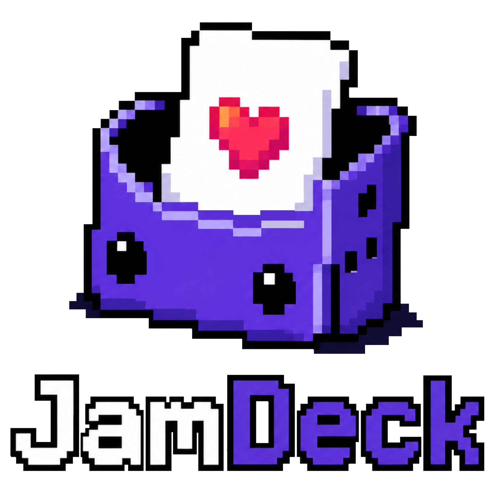

[🇹🇷 Türkçe](README.md) · 🇬🇧 **English**

<b>Game Jam Manager</b> — itch.io submission download · online voting · 48-hour timer · presentation · results ceremony

# JamDeck — Game Jam Manager

**All-in-one desktop toolkit for running game jams** — downloads builds from
itch.io, presents them on stage, runs weighted **online** voting from phones
(fixed link/QR, stable up to ~500 people), reveals results with a cinematic
ceremony, and puts a themed 48-hour countdown on the venue screen. Customizable for any jam.
Available in **7 languages** — Türkçe · English · Français · Deutsch · Español ·
Português · 日本語.

## ⬇️ Download

**[Get the latest release →](../../releases/latest)**

| File | What for |
|---|---|
| `JamDeck-Setup-vX.Y.Z.exe` | **Recommended** — classic installer: Start Menu + desktop shortcut, uninstaller. No admin rights needed. |
| `JamDeck-vX.Y.Z-win64.zip` | Portable: extract to a folder and run `JamDeck.exe`. Even works from a USB stick. |

- On the Windows SmartScreen warning: **More info → Run anyway** (the app is unsigned).
- The installer configures the Windows Firewall permission with a single
  admin confirmation — no firewall popup when you start voting/countdown at the jam.
- Everything after that is automatic: on startup the app announces new
  versions; click **Download & Install** and it updates itself — your settings
  and votes are preserved (in both distributions).

**Requirements:** Windows 10/11 (WebView2 — preinstalled on Windows 11).

## ✨ Features

| | |
|---|---|
| 📥 **Download & Prepare** | One-click itch.io jam archive download, extracts zip/rar/7z/tar and nested archives, pulls game name + cover automatically, flags broken submissions |
| 🎬 **Presentation** | Fullscreen stage: game list + giant cover + one-click launch; auto-close on time-up, web (HTML5/WebGL) games included |
| 🗳️ **Online Voting** | Jury / Audience / Team vote from phones **online** (fixed link/QR, stable up to ~500 people, no shared Wi-Fi needed); weighted categories, single-use access codes, **live code board** (used codes flip instantly for everyone), QR screen |
| 🏆 **Results** | Top-3 podium, per-group breakdowns, shareable PNG results poster + technical .xlsx report |
| ⏱️ **Countdown** | 48-hour jam timer: 8 styles (Neon, LED, Pixel, Glitch, HP-Bar…), 3 logo slots, **auto-fullscreen from any screen** 10 minutes before start, OBS Browser-Source support |
| 🎨 **Themes** | 16 presets + full color/font/effect customization; the theme carries over to the phone voting page |
| 📋 **Submission Guide** | Rules screen to share with participants + 1080×1920 poster export; texts editable in-app |
| 🔄 **Auto-Update** | The app finds, downloads and installs new versions by itself |
| 🌍 **7 Languages** | Whole UI in Turkish, English, French, German, Spanish, Portuguese and Japanese — including the phone voting page, code board and OBS countdown; default vote categories localize too, switch live from a dropdown |

## 📸 Screenshots

| Presentation stage | Setup & themes |
|---|---|
|  |  |

| Voting admin | Voting on a phone | Live code board |
|---|---|---|
|  |  |  |

| Countdown (Pixel style) | Countdown setup | Results |
|---|---|---|
|  |  |  |

## 📖 User Guide

### ➡️ **[Open JamDeck Guide (one click)](https://tarikyzco.github.io/JamDeck/JamDeck-Guide.html)**

Step-by-step interactive guide — all screens, FAQ and tips. Opens directly in your browser
(currently in Turkish); you can also download it for offline use.

## ❓ FAQ

**What is JamDeck?**
A free Windows app that runs the whole operational side of a game jam (a "game jam
manager"): it downloads submissions from itch.io, presents them on stage, collects
online votes from phones, reveals results with a ceremony, and shows a 48-hour
countdown on the OBS/venue screen.

**Who is it for?**
Game jam and hackathon organizers, university game-dev clubs, and event hosts who
want one tool instead of stitching together a timer, a voting form, and a slideshow.

**Does it need the internet?**
The presentation and countdown run offline. Voting runs over the internet via a
fixed public link/QR; downloading submissions and updates also use the internet.

**How does voting work? Do I need an account?**
Voters just scan a QR and vote from their phone — nothing to install. The organizer
signs into Tailscale once (free) on first use so the app can publish a stable voting
link. Weighted categories, single-use codes, live code board; stable up to ~500 people.

**Is it free? Is it open source?**
It is completely free and **open source** under the [GPL-3.0](LICENSE) license.

**What platforms?**
Windows 10/11 (WebView2). The phone voting pages work on any device with a browser.

## 🔎 Keywords

Game jam manager · game jam software · game jam voting app · game jam timer ·
48-hour countdown timer · jam presentation tool · itch.io submission downloader ·
online voting from phones · QR code voting · hackathon management software · OBS
countdown browser source · game jam results / scoring · Windows game jam organizer tool.

## ℹ️

JamDeck is a **free**, **open-source** ([GPL-3.0](LICENSE)) game jam management
application. Use the [Issues](../../issues) page for bug reports and suggestions.

© 2026 tarikyzco
